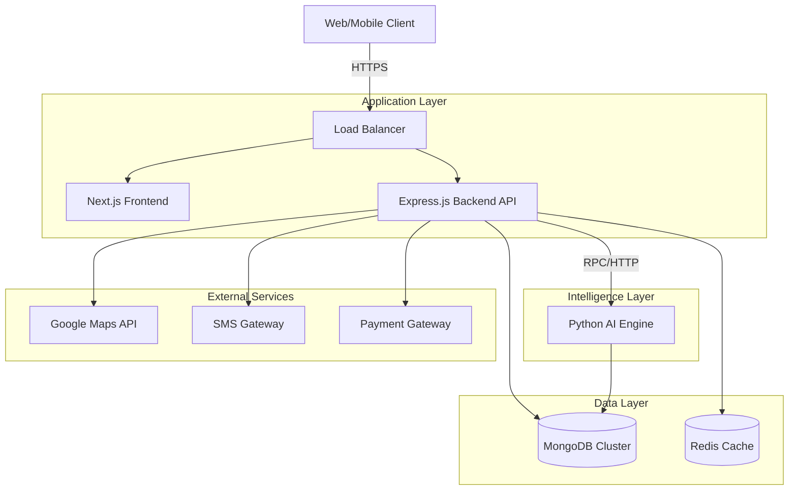

# TruckNet India - System Architecture

## 1. Executive Summary

TruckNet India is a logistics platform designed to connect Truck Owners, Drivers, and Customers. It utilizes a modern microservices-inspired architecture with a Next.js frontend, an Express.js operational backend, and a dedicated Python-based AI Engine for intelligent decision-making (matching, routing, pricing).

**Target Scale:** 1 Million Concurrent Users

---

## 2. High-Level Architecture

The system follows a 3-tier architecture with a specialized AI service layer.



---

## 3. Technology Stack

### Frontend (`apps/web`)
*   **Framework:** Next.js 16 (React 19)
*   **Language:** TypeScript
*   **Styling:** Tailwind CSS v4, Shadcn UI
*   **State Management:** React Context + Hooks (SWR/TanStack Query recommended)
*   **Real-time:** Socket.io Client

### Backend API (`apps/api`)
*   **Runtime:** Node.js
*   **Framework:** Express.js
*   **Language:** TypeScript
*   **Database ODM:** Prisma / Mongoose (Hybrid)
*   **Auth:** JWT (JSON Web Tokens)
*   **Real-time:** Socket.io Server

### AI Engine (`apps/ai_engine`)
*   **Framework:** FastAPI
*   **Language:** Python 3.x
*   **ML Libraries:** Scikit-learn, Pandas, NumPy
*   **Optimization:** NetworkX (Routing)

### Infrastructure & Data
*   **Database:** MongoDB (Replica Set enabled)
*   **Caching:** Redis (Recommended for session/data caching)
*   **Containerization:** Docker
*   **Orchestration:** Kubernetes (K8s) for scaling

---

## 4. Database Schema

The database uses a document-oriented model (MongoDB) but enforces strict schemas via Prisma/Mongoose.

### Core Models

#### `User`
*   **Purpose:** Central identity entity.
*   **Key Fields:** `_id`, `email`, `phone`, `password` (hashed), `role` (DRIVER, OWNER, CUSTOMER, ADMIN), `isVerified`.

#### `DriverProfile`
*   **Relation:** 1:1 with User.
*   **Key Fields:** `licenseNumber`, `experienceYears`, `isAvailable`, `currentLat`, `currentLng`, `vehicleId` (Active vehicle).

#### `OwnerProfile`
*   **Relation:** 1:1 with User.
*   **Key Fields:** `companyName`, `gstNumber`.

#### `Vehicle`
*   **Purpose:** Physical transport assets.
*   **Key Fields:** `number` (License Plate), `type` (Truck/Container), `capacity`, `status` (AVAILABLE, ON_TRIP, MAINTENANCE), `ownerId`.

#### `Load`
*   **Purpose:** Cargo to be transported.
*   **Key Fields:** `source`, `destination`, `weight`, `goodsType`, `price`, `status`, `ownerId`.

#### `Ride` (Booking)
*   **Purpose:** An active logistics transaction.
*   **Key Fields:** `customerId`, `driverId`, `vehicleId`, `source`, `destination`, `price`, `status`, `pickupLat/Lng`, `dropLat/Lng`.

#### `Match`
*   **Purpose:** AI-generated pairing candidates.
*   **Key Fields:** `loadId`, `vehicleId`, `score` (0-1), `status`.

---

## 5. API Routes & Microservices

### Backend API (`apps/api`)

| Module | Route Prefix | Description |
| :--- | :--- | :--- |
| **Auth** | `/api/auth` | Register, Login, Refresh Token, Reset Password. |
| **Vehicles** | `/api/vehicles` | CRUD operations for vehicles, status updates. |
| **Loads** | `/api/loads` | Posting loads, browsing available loads. |
| **Rides** | `/api/rides` | Booking creation, status tracking, cancellations. |
| **Driver** | `/api/driver` | Driver availability toggle, location updates. |
| **Matches** | `/api/matches` | Retrieve AI-suggested matches for loads/vehicles. |
| **Roadside** | `/api/roadside` | Emergency SOS and breakdown assistance. |
| **AI Proxy** | `/api/ai` | Proxy endpoints forwarding complex tasks to the Python Engine. |

### AI Engine (`apps/ai_engine`)

| Endpoint | Method | Purpose |
| :--- | :--- | :--- |
| `/get-insights` | POST | Role-based dashboard insights (Earnings, Maintenance, Routes). |
| `/match` | POST | Matches Drivers/Vehicles to Loads based on location & constraints. |
| `/predict-eta` | POST | Calculates ETA considering weather and traffic factors. |
| `/predict-price`| POST | Dynamic pricing engine based on demand/supply. |
| `/trigger-sos` | POST | Locates nearest emergency services. |

---

## 6. Authentication Flow

1.  **Login:** User sends credentials to `/api/auth/login`.
2.  **Verification:** Server verifies bcrypt hash.
3.  **Token Issuance:**
    *   **Access Token:** Short-lived (15 min), signed with `JWT_SECRET`. Contains `userId` and `role`.
    *   **Refresh Token:** Long-lived (7 days), stored in HTTPOnly cookie or secure DB storage.
4.  **Protected Requests:** Frontend attaches `Authorization: Bearer <token>` header.
5.  **Middleware:** Express middleware verifies token signature and decodes user role for RBAC (Role-Based Access Control).

---

## 7. Folder Structure (Monorepo)

```text
/
├── apps/
│   ├── web/                 # Next.js Frontend
│   │   ├── app/             # App Router pages
│   │   ├── components/      # UI Components
│   │   └── lib/             # Utilities & API clients
│   │
│   ├── api/                 # Express Backend
│   │   ├── src/
│   │   │   ├── controllers/ # Request Logic
│   │   │   ├── models/      # Mongoose Models
│   │   │   ├── routes/      # API Route definitions
│   │   │   └── services/    # Business Logic
│   │   └── prisma/          # Database Schema
│   │
│   └── ai_engine/           # Python AI Service
│       ├── main.py          # FastAPI Entry point
│       ├── matching.py      # Matching Algorithms
│       └── models.py        # Pydantic Models
│
└── packages/                # Shared internal packages (Optional/Future)
```

---

## 8. Environment Variables Plan

### Global / Shared
*   `NODE_ENV`: production / development

### Apps/API
*   `PORT`: Server port (e.g., 5000)
*   `DATABASE_URL`: MongoDB Connection String
*   `JWT_SECRET`: Secret key for signing tokens
*   `AI_ENGINE_URL`: URL of the Python AI service (e.g., http://localhost:8000)
*   `GOOGLE_MAPS_KEY`: For geocoding and maps
*   `GEMINI_API_KEY`: For GenAI text features

### Apps/AI_Engine
*   `PORT`: Service port (e.g., 8000)
*   `MODEL_PATH`: Path to serialized ML models

---

## 9. Scaling Strategy (1M Users)

To handle 1 million users (approx. 50k-100k concurrent), the following strategies will be employed:

### 1. Database Scaling (Sharding)
*   **Horizontal Sharding:** MongoDB sharding based on `userId` or `geo-region` (e.g., North/South India) to distribute read/write load.
*   **Read Replicas:** Separate Primary (Write) and Secondary (Read) nodes to offload heavy read queries (e.g., "Find Loads").

### 2. Caching Layer (Redis)
*   **Session Store:** Store active refresh tokens and user sessions.
*   **Data Caching:** Cache frequent queries like "Available Loads in City X" for 60 seconds.
*   **Geo-Spatial Indexing:** Use Redis Geo to store real-time driver locations for sub-millisecond proximity searches.

### 3. Asynchronous Processing (Message Queue)
*   **RabbitMQ / Kafka:** Decouple heavy operations.
    *   *Example:* When a Load is posted, push an event to the queue. The Matching Service consumes this event to calculate matches asynchronously, notifying users via Socket.io when done.

### 4. Container Orchestration
*   **Kubernetes:** Deploy `api` and `ai_engine` as scalable pod replicas.
*   **HPA (Horizontal Pod Autoscaler):** Automatically add pods when CPU/Memory usage > 70%.

### 5. CDN & Static Assets
*   Serve all Next.js static assets and uploaded images via a CDN (Cloudflare/AWS CloudFront) to reduce server load.
